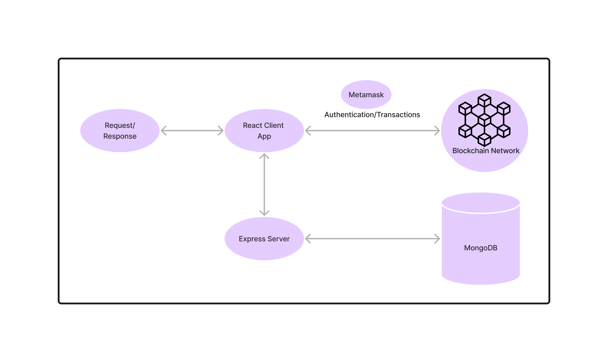

## Basic Application Flow
<hr/>


``` "This is the basic Application workflow" ```
### Data stored in blockchain:
1. Organisation Details:
    - id (Unique for each organisation)
    - Name
    - Email
    - Contact Number
    - Type of Organisation i.e. Nursing home/ Super Speciality Hospital/ General Hospital etc.
    - Address
    - Role i.e. Admin/Organisation
    - Verification Status i.e. if the organisation verified by the admin or not.
2. Patient Details:
    - Patient Id
    - Name
    - Address
    - Age
    - Phone Number
    - Email
    - Organisation Name that the patient belongs to
### Data stored in MongoDB:
1. Report Details:
    - Patient Id
    - Report Date
    - Test Name
    - Required fields for Medical test report
        * rbc (Red Blood Count)
        * Hemoglobin
        * hct (Hematocrit)
        * mcv (Mean Corpuscular volume)
        * mch (Mean Corpuscular Hemoglobin)
        * mchc (Mean Corpuscular Hemoglobin Concentration)
        * rdw_cv (Red Cell Distribution Width-Coefficient of Variation)
        * tlc (Total Leukocyte Count)
        * tsh (Thyroid Stimulating Hormone)
        * t3 (Triiodothyronine)
        * t4 (thyroxine)
    - Description
2. Patient Details:
    - Patient Id
    - Password
